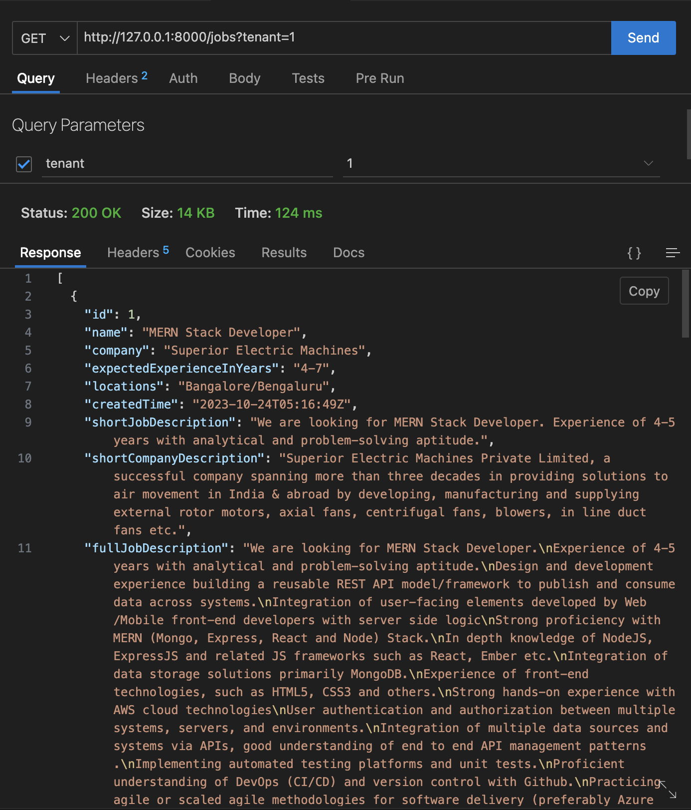

# joblist
A simple job list simulation assignment

## Description

This project contains a server & client parts.

## Server

[Starlette](https://www.starlette.io/) is choosen as the backend framework for server.

Server part has the below features.

* API documentation in [openapi 3.1](https://github.com/OAI/OpenAPI-Specification/blob/main/versions/3.1.0.md) format.
* Table definitions.
* Base classes for implementations like store, service etc.
* Service for job (to handle requests on job resource).
* Store for job, user (to handle DB interations of job, user resources)
* Row level security.
* Util for setting up db and inserting initial user & job data.

### Installation

Create and activate a python3 virtual env.

Install poetry (dependency manager for the project).

```zsh
pip instll poetry
```

Install all dependencies.

```zsh
poetry install
```

### Initial Setup

Please use utils provided in `dp.py` file for initial data loading.

eg:

```zsh
(env_joblist) ➜  joblist git:(feat_server) ✗ python
Python 3.9.6 (default, Oct 18 2022, 12:41:40) 
[Clang 14.0.0 (clang-1400.0.29.202)] on darwin
Type "help", "copyright", "credits" or "license" for more information.
>>> 
>>> from jobserver.db import InitDB, InitData
>>> import json 
>>> from jobserver.contract.models import METADATA
>>> 
>>> init_db = InitDB(METADATA, "test_job_db", "localhost", 5432, "test_user", "", [1,2])
>>> init_db.drop_db()
>>> init_db.drop_roles()
>>> 
>>> init_db.create_db()
>>> init_db.create_roles()
>>> 
>>> 
>>> with open("/Users/test_user/work/joblist/server/tests/jobs.json", "r") as source:
...     jobs = json.load(source)
... 
>>> init_data = InitData(jobs["users"], jobs["jobs"], "test_job_db", "localhost", 5432, "test_user", "")
>>> init_data.create_jobs()
>>> init_data.create_users()
```

The above instructions will,

* Create all tables.
* Set row level permissions for 2 users with id's `1, 2`.
* Create 2 users with given name and email in `jobs.json`.
* Create all job data in `Job` table from `jobs.json`.

### Run

To run the server (after installation).

```zsh
uvicorn jobserver.server:app
```

ps: Please ensure a `.env` file is created and all necessary values are given. An example `.env.example` file is given in the project.

### Example



## Client

Client part needs to be implemented in future using `next.js`
